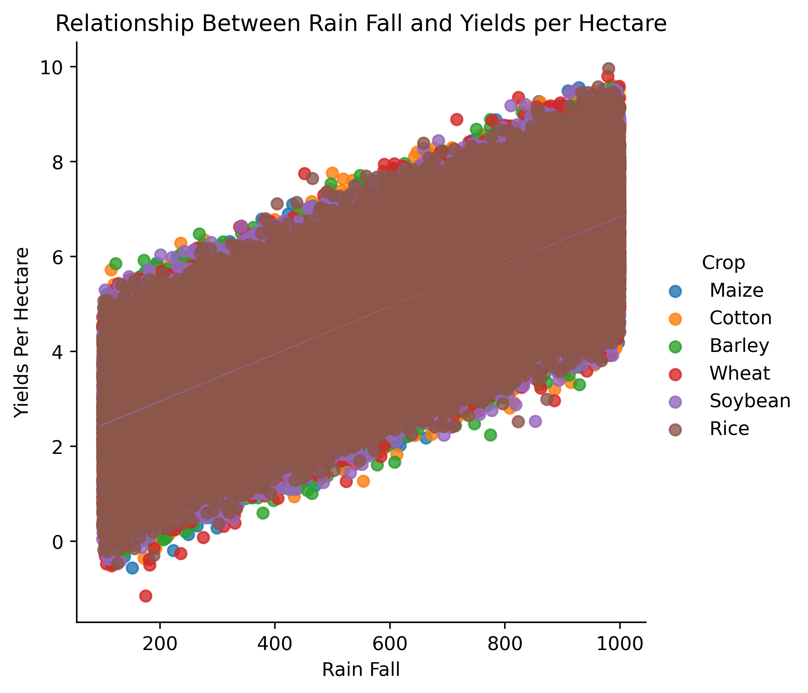
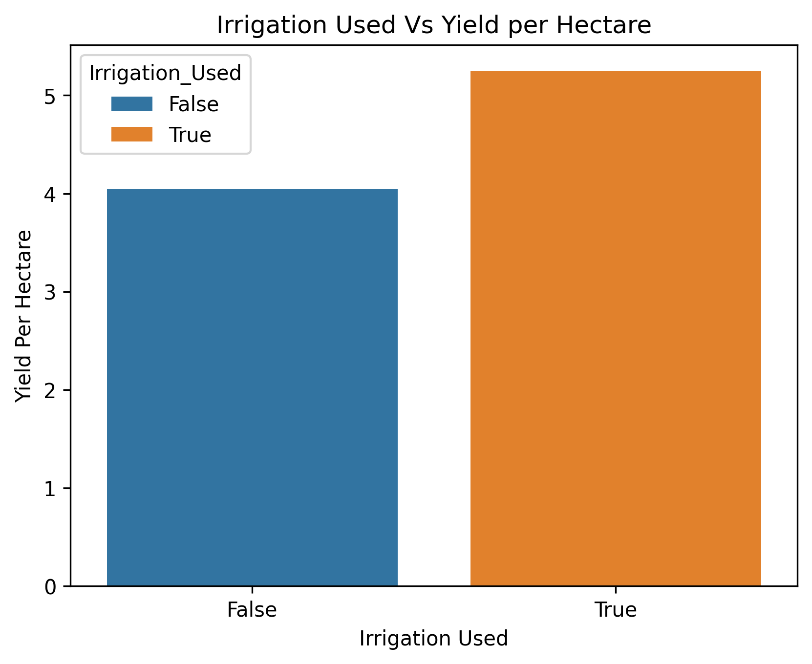

**Crop Yield Predictive Model**

📝**Project Overview**
Crop Yield Predictive Model is Comprehensive Data science project that aims to help a given farm to predict how much Crop Yield Tons estimated to be harvested Per Hectare based on different factors such as Qantity Of Rainfall, Temperature, Soli Type, Crop Type, Using Irrigation method, Fertilizer and etc, which will help farm to take different decision based on climate changes in order to maximize production.

✅**This Project is designed to do The Following:**

1. Mitigate Effects of Climate Change on Production.
2. Providing Past Production Analytics.
3. Increase Predictive Analytics and Learned Decison Making
4. Analyze The Impact of using Fertilizer and Irrigation method on Production.

Features in dataset used include:

Rainfall_mm, Crop, Temperature_Celsius, Fertilizer_Used, Irrigation_Used,
Weather_Condition, Yield_tons_per_hectare

**Business Understanding & Problem Statement**

📐**Problem Definition**

A Given Farming Cooperative Has a Past amount of Agriculture Production Data and they Want to deliver some insights from these data about how they are working, what they need to change, which crops are providing a massive production, which crops are down in harvest,
How climate changes is affecting the production,on which crops Irrigation can Be used more and why?, How can they increase Yields per hectare for each crops, what can they do to increase production in general.

🔃**How Good Final Solution Would look Like?**

1. Delivering Insights about Crops Production Improvement
2. Possible Solution To Be Taken To Mitigate Negative Impact Of Climate Changes On Crop Production.
3. Addressing Effect Of Using Fertilizers and Irrigation.

📂**Data Sources**

Dataset used:
crop_yield.csv this dataset has 1000,000 rows and 10 columns

It was downloaded From https://www.kaggle.com and it is open source.

📝**Methodology**

**Data Collection**

As Mentioned above dataset used in this project downloaded from kaggle.com

**Data Cleaning & Preprocessing**
The main goal of the project was fitting the Agriculture data to Linear Regression I have Created From scratch and use it to predict yield tons per hectare based on the data entered, to achieve that the following preprocessing and cleaning steps taken

1. Convert Bool type to Object.
2. Use Encoding Techniques To Convert Categorical data to numerical in order to have clean and numerical data that is easier for algorithm to learn.

**Exploratory Data Analysis (EDA)**
Through This Process I have Realized How Much Fertilizer, Irrigation, Rain fall and Temperature are the main factors influencing the Yield Tons harvested per hectare

RainFall vs Yield Tons Per Hectare.

Irrigation vs Yield Tons Per Hectare.

**Model Selection & Training**

I have used Linear Regression Model I have Trained From Scratch Using (Linear Algebra)

**Deployment**
This Model is deployed as webapp You can try it on https://jean-zeta.vercel.app/live-demo/1

**How to Use/Reproduce**
Prerequisites:

Here are the software you need to run this project on your pc if you are interested

1.  Python3.12 or newer
2.  Git
3.  Pycharm or VS Code Editor (Recommended)
4.  Jupyter or Jupyter Extension If Using VS Code (To Run exploration.ipynb)

Installation:

# Clone the repository

git clone https://github.com/iraharijeandamour/Crop-Yield-Prediction
cd your-repo-name

# Create a virtual environment (recommended)

python -m venv venv_name
source venv_name/bin/activate # On Windows: venv_name\Scripts\activate

# Install dependencies

pip install -r requirements.txt

Run The Source Code:
For VS Code: 1. Make Sure You are on right Directory after successful installed dependencies in requirements.txt 2. Type python main.py 3. Follow Instruction.
For Pycharm: 1. Make Sure You are on right Directory after successful installed dependencies in requirements.txt 2. ctrl + shift + 10 or find run icon. 3. Follow Instruction.

**Project Structure**
|──data/
| |──preprocessed/
| | |──new_crop_yield.csv
| |──raw_data/
| | |──crop_yield.csv
|──linear_regression/
| |──linear_regression_model
|──models/
| |──binary_encoder.joblib
| |──label_encoder.joblib
| |──linear_model.joblib
| |──one_hot_encoder.joblib
|──notebooks/
| |──exploration.ipynb
|──report/
| |──charts/
| | |──crop_yield_fertilizer.png
| | |──crop_yield_on_weather_condition.png
| | |──crops_count_barplot.png
| | |──fertilizer_yield.png
| | |──rainfall_vs_yield.png
|  
|──src_code/
| |──model_training.py
| |──preprocessing.py
|
|──main.py
|──README.md
|──requirements.txt
